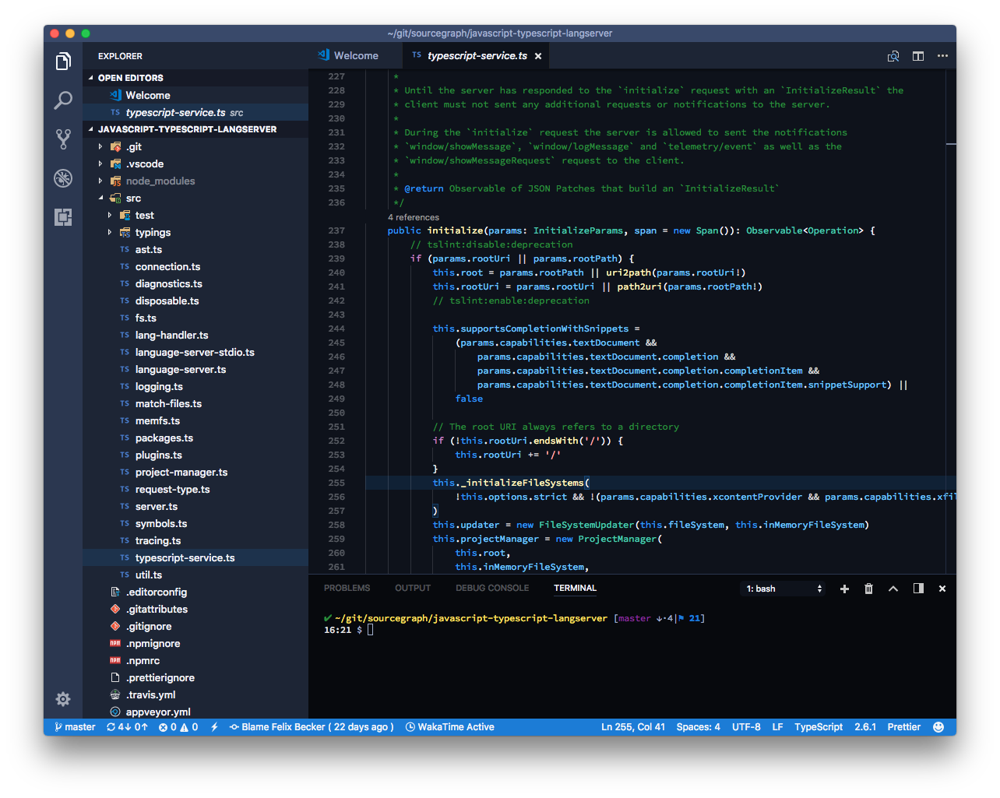

# Sourcegraph color theme

[](https://marketplace.visualstudio.com/items?itemName=sourcegraph.vscode-sourcegraph-theme) [](https://marketplace.visualstudio.com/items?itemName=sourcegraph.vscode-sourcegraph-theme) [](https://marketplace.visualstudio.com/items?itemName=sourcegraph.vscode-sourcegraph-theme)



## Development

To install it manually, clone this repository and run:

```
./dev.sh attach
```

Then reload VS Code and you should see the Sourcegraph Theme in the extensions list. You can now select the "Sourcegraph Dark" theme in the list that appears when you run the `Preferences: Color Theme` action.
